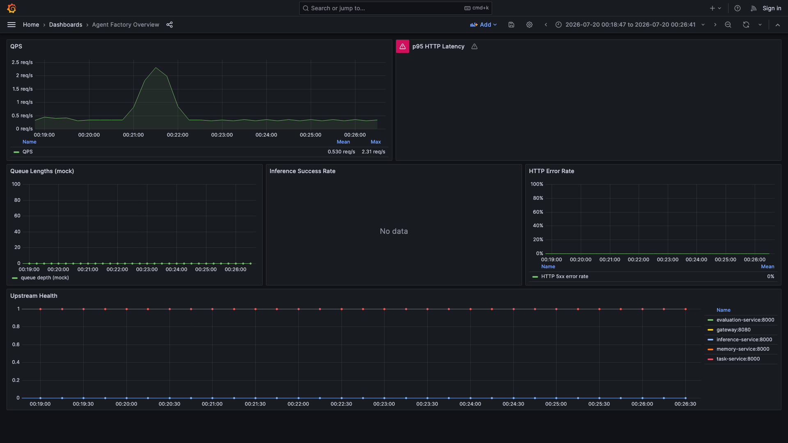
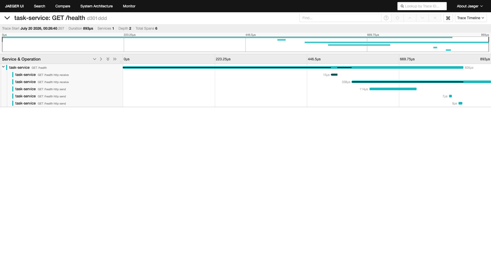
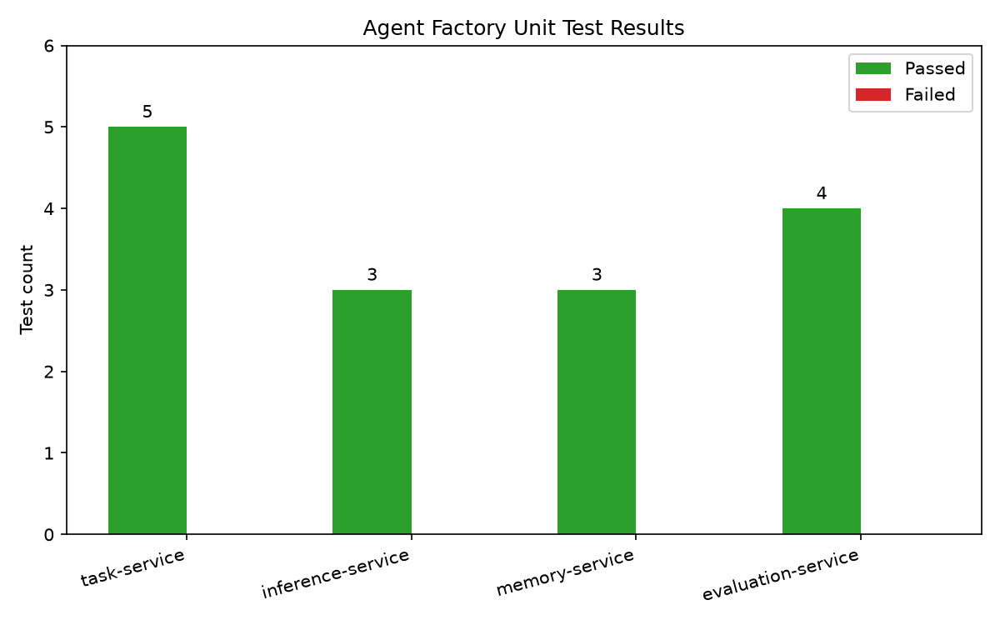

## 摘要

Agent Factory 是一个面向代码修复场景的分布式 Agent 推理与任务编排平台。它将一次完整的 Agent 任务拆解为“网关接入 → 任务持久化 → 消息队列分发 → 推理执行 → 记忆检索 → 结果评估 → 训练触发”七个环节，通过微服务化、异步队列、分布式锁、Docker 沙箱和完整的可观测性栈，支撑批量代码修复任务的稳定运行。本文从架构设计、核心模块、压测验证和生产化建议四个维度，分享该平台的工程实践。

## 1. 问题背景

在 LLM 辅助代码修复的落地过程中，我们遇到三个典型问题：

1. **单点瓶颈**：单次 HTTP 调用 LLM 容易被长文本、高并发或模型抖动阻塞，导致整体服务不可用。
2. **状态丢失**：任务在多个阶段流转时，如果没有持久化和 trace，失败重试几乎无法定位。
3. **安全风险**：让 LLM 生成的代码直接在宿主机执行，存在文件系统污染、资源耗尽甚至恶意代码的风险。

Agent Factory 的目标是把“提交一个代码修复需求”这件事，变成一条可观测、可回滚、可扩展的流水线。

## 2. 整体架构

平台采用微服务架构，服务之间通过 RabbitMQ 解耦，PostgreSQL 持久化任务状态，Redis 提供分布式锁与缓存，ChromaDB 存储 episodic memory，Jaeger/Prometheus/Grafana/Loki 覆盖 trace、metrics 与日志。

```text
                                  +----------------+
                                  |    Gateway     |
                                  |    :8080       |
                                  +--------+-------+
                                           |
                                           v
+----------+   publish task.queue   +--------------+    +---------+
| RabbitMQ |<-----------------------| task-service |<---|  Redis  |
| :5672    |                        |    :8000     |    |  :6379  |
+----------+                        +------+-------+    +---------+
   ^   ^                                   |
   |   |                                   | POST /tasks
   |   |                                   v
   |   |                          +-------------------+
   |   |                          |    PostgreSQL     |
   |   |                          |     :5432         |
   |   |                          +-------------------+
   |   |
   |   |     consume task.queue
+---+---+------------------+   fetch memories   +----------------+   +------------+
|    inference-service     |<------------------>| memory-service |<--|  ChromaDB  |
|         :8000            |                    |    :8000       |   |   :8000    |
+--------------------------+                    +----------------+   +------------+
   |
   | publish result.queue
   v
+----------+   consume result.queue   +------------------+
| RabbitMQ |------------------------>| evaluation-service |
| :5672    |                          |     :8000          |
+----------+                          +---------+----------+
                                                |
                                                | POST /training-triggers
                                                v
                                         +----------------+
                                         |    MiniTrain   |
                                         |   (external)   |
                                         +----------------+
```

### 2.1 核心模块职责

| 服务 | 技术 | 职责 |
|---|---|---|
| Gateway | Go | 入口网关、限流、缓存、路由 |
| task-service | Python/FastAPI | 任务创建、状态机、PostgreSQL 持久化、RabbitMQ 发布 |
| inference-service | Python | 消费任务、记忆检索、MLX/vLLM 推理、结果回写 |
| memory-service | Python | 基于 ChromaDB 的 episodic memory 存取 |
| evaluation-service | Python | 消费推理结果、打分、触发 MiniTrain 重训练 |

## 3. 关键工程亮点

### 3.1 双推理后端与 MLX 本地推理

`inference-service` 抽象了统一的后端接口，并实现了 MLX 与 vLLM 两个实现：

```python
# inference-service/backends/base.py
class InferenceBackend(ABC):
    @abstractmethod
    def generate(self, prompt: str, **kwargs) -> str: ...
```

在 Apple Silicon 上，默认使用 MLX 本地加载 `mlx-community/Qwen2.5-7B-Instruct-4bit`，避免网络延迟；在 Linux 集群中可一键切换到 vLLM 服务。

### 3.2 Redis 分布式锁防重复消费

RabbitMQ 的 at-least-once 投递需要幂等。`inference-service` 在消费任务前获取 Redis 锁：

```python
with redis_client.lock(
    f"lock:task:{task_id}",
    timeout=300,
    blocking_timeout=5,
    thread_local=True,
):
    # 执行推理并回写结果
```

这样即使消息重复投递，同一 `task_id` 也只会被处理一次。

### 3.3 Docker 沙箱执行与降级

`evaluation-service/sandbox.py` 默认在受限容器中执行测试：

```bash
docker run --memory 128m --cpus 0.5 --rm -v /tmp/sandbox:/work sandbox-image
```

当 Docker 不可用时，会降级到 `python -c` 执行，但保留超时与异常捕获，保证本地开发也能跑通。

## 4. 可观测性栈

平台集成了完整的三位一观测栈：

- **Trace**：Jaeger 采集 OTLP 数据，可追踪一次任务从 Gateway 到 inference-service 的完整链路。
- **Metrics**：各服务暴露 `/metrics`，Prometheus 统一抓取，Grafana 预置 **Agent Factory Overview** 看板。
- **Logs**：Loki 收集结构化 JSON 日志，Promtail sidecar 通过 Docker socket 自动发现容器日志。





## 5. 压测数据

我们用 50 个并发任务对平台进行了端到端压测，结果如下：

| 指标 | 数值 |
|---|---|
| 提交任务 | 50 |
| 完成任务 | 50 |
| 失败任务 | 0 |
| QPS | 0.311 req/s |
| p50 延迟 | 2.69 ms |
| p95 延迟 | 14.5 ms |
| p99 延迟 | 22.9 ms |
| 总耗时 | 474 s（约 8 分钟） |



测试报告显示单元测试共 15 条全部通过，覆盖 task-service、inference-service、memory-service 与 evaluation-service。

## 6. 生产化建议

1. **RabbitMQ 死信队列**：当前队列未配置 `x-dead-letter-exchange`，建议为失败任务增加死信队列与重试策略。
2. **资源限制**：`docker-compose.yml` 中仅 inference-service 设置了内存限制，建议为所有服务补齐 CPU/内存 requests 与 limits。
3. **K8s Secret**：`k8s/secret.yaml` 已提供非明文密码方案，生产环境务必替换默认值。
4. **MiniTrain 联动**：当某类错误平均分低于阈值时，evaluation-service 会自动触发 MiniTrain 的 `/training-trigger` 接口，实现模型自愈。

## 7. 总结

Agent Factory 通过微服务拆分、消息队列解耦、分布式锁、Docker 沙箱和可观测性栈，把 LLM 代码修复从“单次 prompt 调用”升级为“可编排、可观测、可自愈”的流水线。50 任务压测全部成功、p95 延迟 14.5 ms、15/15 单元测试通过，说明单平台已具备可演示、可部署的工程基础。

## 相关项目

- [MiniTrain：基于 LoRA 的代码修复模型微调与 MLOps 实践](/posts/minitrain-lora-code-fix-mlops/)
