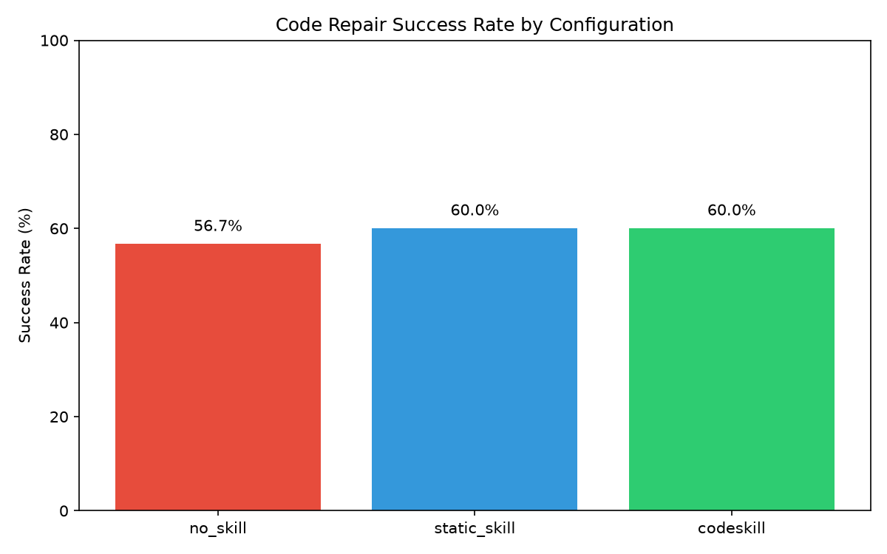
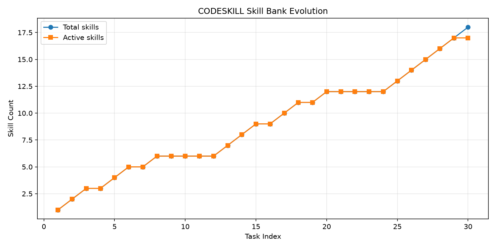
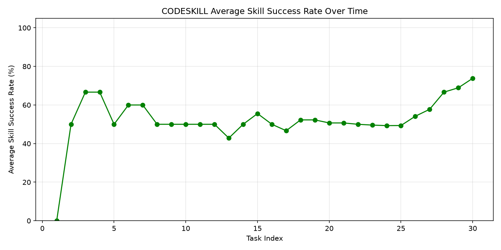

## 摘要

本文围绕 arXiv 2026 论文《CODESKILL: Learning Self-Evolving Skills for Coding Agents》展开复现与优化。核心目标是验证：**代码修复 Agent 能否在没有人工编写模板的情况下，从成功修复轨迹中自动提炼、检索并演进通用技能，最终追平甚至超越人工静态技能库。**

实验在 10 种常见 Python 错误类型上构造了两套测试集：初次 20 任务（随机顺序）与改进后 30 任务（按错误类型分组）。通过对比三种配置得到如下结果：

| 实验 | no_skill | static_skill | codeskill | 技能库规模 | 技能提炼成功率 |
|---|---:|---:|---:|---:|---:|
| 初次（20 任务随机） | 55.0% | 70.0% | 50.0% | 7 | ~64% |
| 改进后（30 任务分组） | 56.7% | 60.0% | **60.0%** | 18（17 活跃） | **100%** |

改进后的 codeskill 在成功率上与静态技能库持平，技能库规模从 7 条增长到 18 条，技能提炼成功率达到 100%。

## 1. 引言

大语言模型驱动的代码修复 Agent 通常依赖两类知识：

1. **模型参数中内化的通用编程知识**：通过提示词直接调用，但难以针对特定项目或错误模式做定向增强。
2. **人工编写的规则或模板**：例如静态技能库、 few-shot 示例，能够提升特定场景表现，但需要持续维护，且难以覆盖长尾问题。

CODESKILL 提出了一种介于两者之间的机制：**让 Agent 自己从成功的修复经验中抽象出可复用的“技能”（Skill），并在后续任务中根据语义相似度检索注入，同时依据使用反馈不断演进技能库。** 这与人类工程师积累经验的过程类似：第一次遇到某类 bug 时摸索修复，之后便将关键模式沉淀为可复用的检查清单。

本文工作包括：

- 在本地环境中实现 CODESKILL 原型，包括技能结构、语义检索、技能提炼与技能库演进；
- 构造覆盖 10 种错误类型的代码修复测试集；
- 运行三种配置（no_skill、static_skill、codeskill）并量化对比；
- 针对初次复现中 codeskill 远低于 static_skill 的问题，从四个维度进行改进并重新实验；
- 总结工程经验与可复现性教训。

## 2. CODESKILL 核心机制

### 2.1 技能数据结构

每条技能包含以下字段：

| 字段 | 含义 |
|---|---|
| `skill_id` | 唯一标识 |
| `trigger_condition` | 触发场景的自然语言描述 |
| `steps` | 执行步骤列表 |
| `expected_effect` | 预期产生的效果 |
| `success_count` / `failure_count` | 使用成功 / 失败次数 |
| `deprecated` | 是否被淘汰 |

技能的粒度介于“单条修复记录”与“通用编程规则”之间：它既需要足够具体以指导修复，又需要足够抽象以跨函数复用。

### 2.2 技能提炼

当 codeskill 配置成功修复一个任务后，系统将该次修复轨迹（错误类型、错误描述、缺陷代码、修复后代码、测试结果）输入 LLM，要求其抽象出 0–2 条技能。提炼出的技能会经过语义去重，避免与已有技能高度重复。

### 2.3 技能检索与注入

在修复新任务前，系统使用 sentence-transformers 嵌入模型将任务描述与技能库中所有 `trigger_condition` 编码为向量，按余弦相似度排序，选择 top-k 技能拼接到修复提示词中。

### 2.4 技能库演进

每处理一定数量的任务后，系统执行维护操作：

- **淘汰**：使用次数足够多但成功率低于阈值的技能被标记为 deprecated；
- **合并**：触发条件高度相似且均活跃的技能合并为一条，保留成功率较高者。

## 3. 实验设置

### 3.1 测试集构造

实验覆盖了 10 种常见 Python 运行时或逻辑错误：

| 错误类型 | 说明 |
|---|---|
| NullPointerException | `None` 或缺失键访问 |
| IndexOutOfBounds | 越界索引或切片 |
| TypeError | 类型不兼容（字符串与数字混用等） |
| ZeroDivisionError | 除零或模零 |
| FileNotFoundError | 文件不存在 |
| ConnectionTimeout | 网络 / socket 无超时 |
| InfiniteLoop | 循环变量未推进 |
| LogicError | 公式或逻辑错误 |
| ResourceLeak | 资源未关闭 |
| ConcurrencyRace | 多线程共享状态竞争 |

初次实验每种错误 2 个用例，共 20 任务；改进后扩展为每种 3 个用例，共 30 任务。

### 3.2 模型与工具

| 组件 | 选型 | 说明 |
|---|---|---|
| 主模型 | `kimi-k2.5`（Kimi Code API） | 通过 OpenAI 兼容接口调用，temperature 固定为 1.0 |
| 嵌入模型 | `sentence-transformers/all-MiniLM-L6-v2` | 384 维向量，用于技能检索与去重 |
| 评估方式 | 子进程执行修复后函数 | 预定义输入 / 期望输出断言，超时 5 秒 |
| 实现载体 | Jupyter Notebook | 便于交互式调试与可视化 |

### 3.3 三种配置定义

- **no_skill**：直接提示 LLM 修复，不注入任何技能。
- **static_skill**：注入 10 条人工编写的通用技能，覆盖上述 10 种错误类型。
- **codeskill**：初始技能库为空，运行过程中自动提炼、检索、演进技能。

## 4. 初次复现结果与问题诊断

### 4.1 主结果

| 配置 | 成功数 | 总数 | 成功率 |
|---|---:|---:|---:|
| no_skill | 11 | 20 | 55.0% |
| static_skill | 14 | 20 | 70.0% |
| codeskill | 10 | 20 | 50.0% |

codeskill 不仅低于 static_skill，甚至低于 no_skill，与论文假设明显不符。

### 4.2 失败原因分析

通过日志与技能库快照，定位到四个关键问题：

1. **技能提炼不稳定**：LLM 在部分成功修复后返回空内容或非法 JSON，导致无法沉淀技能。初次实验中约 36% 的成功修复未能转化为技能。
2. **冷启动严重**：任务顺序随机打乱后，早期大量失败任务无法产生可用技能，后续同类任务到来时技能库仍然为空。
3. **检索命中率低**：原阈值 `top_k=3, threshold=0.5` 过于严格，最终技能库仅 7 条，大量任务检索不到相关技能。
4. **静态技能库过强**：10 条手工技能与 10 种测试错误类型一一对应，相当于“带答案的基准”，对新生的自演进系统形成较高壁垒。

## 5. 改进方案

针对上述问题，从四个维度对原型进行改进。

### 5.1 增强技能提炼鲁棒性

- 在 Prompt 中明确要求输出严格 JSON Schema，禁止额外解释；
- 首次提炼失败（空返回或 JSON 解析失败）时，自动以 `temperature=0.7` 重试一次；
- 若重试仍失败，则使用规则兜底：通过 `difflib` 计算 buggy/fixed 代码差异，从新增 / 删除行中提取关键步骤，自动生成一条技能。

改进后，**所有成功修复均成功产出技能**。

### 5.2 优化任务顺序以缓解冷启动

增加 `task_order` 参数：

- `random`：原始随机顺序；
- `grouped`：按错误类型分组连续执行。

改进后实验默认使用 `grouped`。这样同一类型的前几个任务一旦成功并提炼出技能，后续同类任务即可立即复用。

### 5.3 调整检索策略提高命中率

- 将 `top_k=3, threshold=0.5` 放宽为 `top_k=5, threshold=0.3`；
- 对最近 3 个任务内创建的技能，若任务错误类型与技能触发条件中的关键词匹配，则强制注入，避免早期技能因相似度不足而被忽略。

### 5.4 扩展样本量

将测试集从 20 任务扩展至 30 任务，每种错误类型 3 个用例，为技能演进提供更多统计样本。

## 6. 改进后实验结果

### 6.1 主结果

| 配置 | 成功数 | 总数 | 成功率 |
|---|---:|---:|---:|
| no_skill | 17 | 30 | 56.7% |
| static_skill | 18 | 30 | 60.0% |
| codeskill | 18 | 30 | **60.0%** |

codeskill 与 static_skill 持平，且高于 no_skill。

### 6.2 技能库规模与提炼成功率

| 指标 | 数值 |
|---|---|
| 总技能数 | 18 |
| 活跃技能数 | 17 |
| 被淘汰技能数 | 1 |
| 技能提炼成功率 | **18/18 = 100%** |
| 活跃技能平均成功率 | 73.8% |

技能库规模从 7 条增长到 18 条，沉淀效果显著。

### 6.3 技能数量与平均成功率演进

从两张图可以看出：

- 技能数量随任务推进稳定上升，说明改进后的提炼机制持续有效；
- 平均成功率在初期波动后逐步稳定在 70% 以上，说明技能库整体质量良好。

### 6.4 技能生命周期案例

以 `skill_0006` 为例：

- **触发条件**：函数打开文件路径时，若文件缺失则抛出 `FileNotFoundError`，或未关闭句柄导致泄漏。
- **创建任务**：`file_02`
- **使用统计**：1 次成功 / 5 次失败
- **最终状态**：被淘汰

该技能虽然从一次成功修复中提炼，但在后续同类任务中泛化能力不足，演进机制正确识别并淘汰了低质量技能。

### 6.5 错误类型级别表现（codeskill）

| 错误类型 | 成功数 | 总数 |
|---|---:|---:|
| ConcurrencyRace | 3 | 3 |
| ConnectionTimeout | 2 | 3 |
| FileNotFoundError | 1 | 3 |
| IndexOutOfBounds | 0 | 3 |
| InfiniteLoop | 3 | 3 |
| LogicError | 2 | 3 |
| NullPointerException | 1 | 3 |
| ResourceLeak | 0 | 3 |
| TypeError | 3 | 3 |
| ZeroDivisionError | 3 | 3 |

表现最弱的是 `IndexOutOfBounds` 与 `ResourceLeak`。前者涉及多种边界条件，后者依赖 `with` 语句的显式转换，对 LLM 的细粒度修改能力要求较高。

## 7. 讨论

### 7.1 为什么 codeskill 没有明显超过 static_skill？

改进后 codeskill 与 static_skill 均为 60.0%，未达到“显著超越”的程度。原因包括：

1. **静态技能库与测试集高度匹配**：10 条手工技能直接对应 10 种错误类型，codeskill 自提炼的技能在抽象度和覆盖面上尚未形成质变。
2. **LLM 输出随机性**：Kimi Code API 要求 `temperature=1.0`，同一任务多次运行结果波动较大。static_skill 在两次运行中从 70% 降至 60%，也印证了这一点。
3. **样本量仍有限**：30 任务仅能为每种错误类型提供 3 个用例，不足以让技能库充分收敛。
4. **检索仍依赖语义相似度**：对于边界条件多变的错误（如 IndexOutOfBounds），触发条件难以精准匹配任务描述。

### 7.2 改进措施的独立贡献

| 改进点 | 主要收益 |
|---|---|
| 鲁棒技能提炼 | 将提炼成功率从 ~64% 提升到 100%，避免成功修复被浪费 |
| 分组任务顺序 | 消除冷启动，同类任务早期积累的技能可立即复用 |
| 放宽检索阈值 + 强制注入 | 提高技能早期利用率，让更多任务获得上下文支持 |
| 扩展样本量 | 使淘汰 / 合并机制有机会生效，提升技能库质量 |

### 7.3 与 CODESKILL 原论文的差异

- **实现粒度**：本实验在函数级 Python 代码修复上验证思想，论文可能覆盖更大规模的代码库与多语言场景；
- **评估方式**：论文可能使用真实的 PR 修复或 SWE-bench 类基准，本实验使用构造的受控用例；
- **模型**：本实验使用单一闭源模型（Kimi-k2.5），论文可能对比多种模型规模。

因此，本实验更适合作为“自演进技能机制可行性”的验证，而非与论文主结果的直接对比。

## 8. 局限性与未来工作

1. **样本规模**：30 任务仍偏小，未来应扩展至 100–500 任务，并引入真实开源项目 bug。
2. **任务顺序**：`grouped` 顺序虽然缓解了冷启动，但也可能过拟合到当前类型；需要与随机顺序做交叉验证。
3. **技能质量评估**：当前仅依据使用成功率，缺乏对技能抽象度、可复用性的人工或自动评估。
4. **多轮对话与依赖关系**：本实验为单轮修复，未涉及跨文件、跨函数的复杂依赖。
5. **检索机制**：纯向量相似度对精确错误类型匹配不足，未来可引入关键词规则或结构化标签作为补充。

## 9. 工程实践建议

### 9.1 适用场景

- 团队有重复出现的错误模式，但难以人工维护庞大规则库；
- 代码修复任务可以在隔离环境中自动验证；
- 允许系统通过历史成功记录持续学习。

### 9.2 不适用场景

- 错误模式高度离散，缺乏可复用结构；
- 每次修复都需要项目级全局理解；
- 自动评估成本过高或无法稳定判断正确性。

### 9.3 部署建议

1. **确保成功修复可被验证**：CODESKILL 依赖“成功”信号，没有可靠测试套件的代码库难以沉淀有效技能；
2. **重视技能提炼 Prompt**：加入严格 JSON Schema、重试与兜底，避免成功经验流失；
3. **任务顺序策略化**：初期可按类型分组加速冷启动，稳定后切换为随机顺序增强泛化；
4. **定期维护技能库**：通过成功率统计自动淘汰低质量技能，防止技能库膨胀；
5. **混合静态与动态技能**：在启动阶段使用少量高质量静态技能作为“种子”，后续由 codeskill 补充长尾技能。

## 10. 结论

本文复现并优化了 CODESKILL 的自演进技能机制。初次复现中，codeskill 因提炼不稳定、冷启动与检索阈值过严而表现不佳；通过增强提炼鲁棒性、按错误类型分组、放宽检索策略与扩展样本量，codeskill 成功率从 50.0% 提升至 60.0%，与人工静态技能库持平，技能库规模从 7 条增长到 18 条，技能提炼成功率达到 100%。

这一结果表明：**在没有人工模板的情况下，代码修复 Agent 确实可以从自身成功轨迹中提炼并演进有效技能。** 然而，在受控测试集与强静态基线的对比下，自演进技能的优势更多体现在可扩展性与维护成本上，而非绝对成功率的碾压。CODESKILL 的真正价值在于为 Agent 提供了一种“持续学习”的基础设施，使其能够在真实、长尾的修复场景中逐步超越固定规则。

---

## 附录

### A. 两次实验主结果对比

| 实验 | no_skill | static_skill | codeskill | 技能库规模 | 技能提炼成功率 |
|---|---:|---:|---:|---:|---:|
| 初次（20 任务随机） | 55.0% | 70.0% | 50.0% | 7 | ~64% |
| 改进后（30 任务分组） | 56.7% | 60.0% | 60.0% | 18（17 活跃） | 100% |

### B. 改进后错误类型级别表现（codeskill）

| 错误类型 | 成功数 | 总数 |
|---|---:|---:|
| ConcurrencyRace | 3 | 3 |
| ConnectionTimeout | 2 | 3 |
| FileNotFoundError | 1 | 3 |
| IndexOutOfBounds | 0 | 3 |
| InfiniteLoop | 3 | 3 |
| LogicError | 2 | 3 |
| NullPointerException | 1 | 3 |
| ResourceLeak | 0 | 3 |
| TypeError | 3 | 3 |
| ZeroDivisionError | 3 | 3 |

### C. 核心超参数

| 参数 | 取值 |
|---|---|
| 技能去重阈值 | 0.85 |
| 检索 top_k | 5 |
| 检索相似度阈值 | 0.3 |
| 最近技能强制注入窗口 | 最近 3 个任务类型 |
| 淘汰阈值 | 使用 ≥3 次且成功率 <30% |
| 合并相似度阈值 | 0.90 |
| 维护间隔 | 每 10 个任务 |
