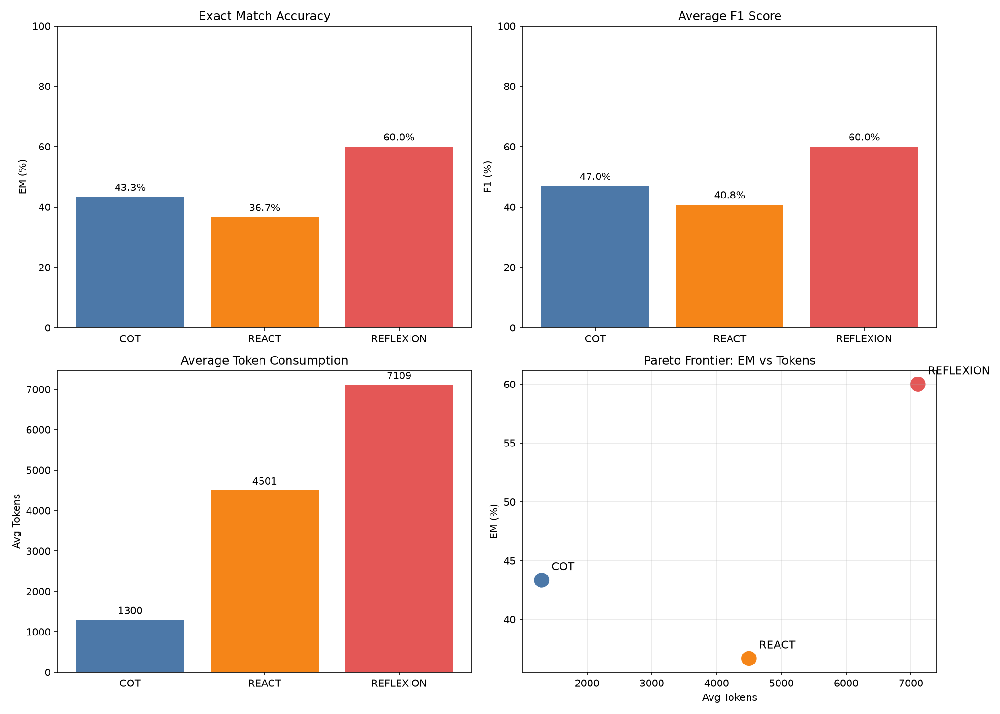

## 摘要

本文在 30 条 HotPotQA `fullwiki` 验证集样本上复现了 CoT、ReAct 与 Reflexion 三种推理范式。使用严格 Exact Match（EM）评估时，Reflexion 的准确率为 **60.0%**，显著高于 ReAct 的 **36.7%** 与 CoT 的 **43.3%**；F1 指标上 Reflexion 同样达到 **60.0%**。然而，Reflexion 的平均 Token 消耗为 **7109**，约为 CoT 的 5.5 倍、ReAct 的 1.6 倍。

进一步拆分 Token 消耗后发现，Reflexion 的第二轮 ReAct 仅消耗 2261 Token，明显低于第一轮的 3962 Token，说明反思信息确实能减少第二轮的冗余搜索与推理。本文基于上述实验数据，分析 Reflexion 的有效来源、成本结构、在不同答案类型上的表现差异、与相关工作的关系，以及在生产环境中使用时的建议与局限。

## 1. 引言

大语言模型在复杂推理任务中表现出色，但存在一个结构性问题：一旦模型在推理早期产生错误，后续步骤往往会沿着错误方向继续推进。CoT（Chain-of-Thought）通过显式推理过程部分缓解了这一问题，ReAct 进一步引入外部工具检索，但两者均缺乏对历史错误的显式修正机制。

Reflexion 提出了一种基于自然语言反思的修正机制：在第一轮 ReAct 失败后，将完整推理轨迹与标准答案输入模型，生成一段语言化的反思；第二轮 ReAct 携带该反思重新尝试。该机制不依赖额外的奖励模型或微调，仅通过多轮 LLM 调用实现错误恢复。

本文通过一次小规模但完整的复现，评估 Reflexion 在 HotPotQA 多跳问答任务上的实际效果与成本，并讨论其是否属于“真正的学习”或“更精细的提示工程”。

## 2. 实验设置

### 2.1 数据集

- **数据集**：HotPotQA `fullwiki` 验证集。
- **采样方式**：按 `seed=42` 随机打乱后取前 30 条。
- **任务特点**：每个问题需要通过 2–3 次 Wikipedia 检索进行多跳推理。

### 2.2 模型与工具

- **模型**：Kimi Code（`kimi-k2p5-coding`），通过 OpenAI 兼容接口调用。
- **检索工具**：Wikipedia API（MediaWiki），用于 ReAct 与 Reflexion 的事实检索。
- **最大步数**：ReAct 循环最多 8 步。

### 2.3 三种范式

- **CoT**：直接要求模型逐步推理并给出最终答案，不调用外部工具。
- **ReAct**：按 Thought → Action（Search/Finish）→ Observation 循环执行，最多 8 步。
- **Reflexion**：第一轮执行 ReAct；若失败，将完整轨迹与标准答案传入模型生成反思；第二轮 ReAct 携带反思重试。

### 2.4 评估指标

- **Exact Match（EM）**：预测与标准答案经小写、去冠词、去标点归一化后完全一致。
- **F1**：预测与标准答案的 token-level F1。

## 3. 核心结果

### 3.1 主结果

| 方法 | EM (%) | F1 (%) | 平均 Token | 平均 Prompt Token | 平均 Completion Token |
|---|---:|---:|---:|---:|---:|
| CoT | 43.33 | 46.95 | 1300.0 | 83.6 | 1216.4 |
| ReAct | 36.67 | 40.78 | 4500.6 | 2048.3 | 2452.3 |
| Reflexion | **60.00** | **60.00** | **7109.0** | 3156.6 | 3952.4 |

Reflexion 的 EM 比 ReAct 高出 **23.3 个百分点**，比 CoT 高出 **16.7 个百分点**。这一结果说明，为 Agent 提供一次事后反思的机会，能够显著降低第二轮重复犯错的概率。

### 3.2 Token 成本拆分

| 阶段 | 平均 Token |
|---|---:|
| 第一轮 ReAct | 3962.0 |
| 反思生成 | 885.8 |
| 第二轮 ReAct | 2261.2 |
| **合计** | **7109.0** |

第二轮 ReAct 的 Token 消耗（2261）明显低于第一轮（3962）。这表明反思信息使 Agent 在第二轮更加聚焦，减少了冗余搜索与无效推理。反思生成本身消耗约 886 Token，但“节省”了第二轮中约 1700 Token 的推理开销。

### 3.3 准确率-Token 权衡

在“准确率-Token”二维坐标系中，Reflexion 位于本次实验三种方法的 Pareto 前沿上：没有任何一种方法能在 Token 更少的情况下达到比它更高的准确率，也没有任何方法能在准确率更高时 Token 更少（限定于本实验的三种方法范围内）。



这意味着：如果目标是在有限预算内获得尽可能高的准确率，Reflexion 是合理选择；如果目标是最低成本地接受一定错误率，则 CoT 更具成本优势。

## 4. 分答案类型的深入分析

不同答案类型的表现差异显著：

| answer_type | count | CoT_EM | ReAct_EM | Reflexion_EM |
|---|---:|---:|---:|---:|
| date | 1 | 100.0% | 100.0% | 100.0% |
| location | 1 | 100.0% | 100.0% | 100.0% |
| number | 3 | 66.7% | 66.7% | 66.7% |
| other | 10 | 10.0% | 20.0% | 50.0% |
| person | 15 | 53.3% | 33.3% | 60.0% |

### 4.1 提升最显著的类型

Reflexion 在 `person` 与 `other` 两类问题上提升最明显：

- **person**：从 ReAct 的 33.3% 提升至 60.0%。人名类问题常涉及“多个同名人物”或“人物关系”，反思能帮助 Agent 意识到“搜对了名字但选错了人”。
- **other**：从 ReAct 的 20.0% 提升至 50.0%。该类别多为电影名、事件名、作品名等非结构化实体，第一轮 ReAct 容易在格式上犯错（如多加年份、附加解释），反思能明确指出标准答案只需要核心名称。

### 4.2 没有提升的类型

**number 类型上没有提升**（三类均为 66.7%）。原因可能是：数字答案的判定非常严格，即使推理过程正确，最终数字的错误也会导致 EM 为 0。反思机制难以修正计算类错误，除非反思能够精确指出“哪一步计算出错”。

### 4.3 样本量限制

`date` 与 `location` 各自仅有 1 条样本，不具备统计意义。`person` 与 `other` 的优势在更大样本上可能保持，但 `number` 很可能仍然是短板。

## 5. 反思机制的有效性拆解

### 5.1 三个典型案例

以下三个案例归纳了 Reflexion 能够覆盖的典型错误模式。

#### 案例 1：过度具体化

- **问题**：What animated movie, starring Danny DeVito, featured music written and produced by Kool Kojak?
- **标准答案**：The Lorax
- **第一轮**：The Lorax (2012)
- **反思**：正确识别电影，但多加了年份并发出空的 Finish 动作。
- **第二轮**：The Lorax

该类错误的特征是：Agent 已掌握核心答案，但因格式或冗余信息被判错。反思相当于明确告知“停在正确答案即可，不要添加额外信息”。

#### 案例 2：格式错误 / 过度解释

- **问题**：Has Stefan Edberg won more events than Édouard Roger-Vasselin?
- **标准答案**：yes
- **第一轮**：Yes, Stefan Edberg has won more events ... (59 total), while Roger-Vasselin ... (28 total).
- **反思**：进行了冗余搜索，给出冗长解释，而标准答案只需要 `yes`。
- **第二轮**：yes

该类错误属于“输出形式与任务要求不匹配”。反思能帮助 Agent 对齐评估器期望的最终答案格式。

#### 案例 3：搜索策略局限

- **问题**：Jason Regler ... during a song built around which instrument?
- **标准答案**：an organ
- **第一轮**：（空）
- **反思**：过度依赖 Wikipedia，没有尝试更广泛的搜索；下一次应确保最终动作格式正确。
- **第二轮**：organ

该案例说明反思有时能促使 Agent 更换搜索策略。虽然本实现中工具只有 Wikipedia，但反思文本中确实出现了“应尝试 broader web search”的自我批评。

### 5.2 反思的本质：动态提示增强 vs 真正的学习

从当前实现来看，Reflexion 更接近**针对具体错误的动态提示增强**，而非“真正的学习”。真正的学习应具备两个特征：

1. **错误到修正的泛化**：看到 A 类错误后，能在未来遇到相似的 B 类错误时自动避免。
2. **不依赖标准答案**：人类复盘时往往不知道标准答案，而是从环境反馈中总结原因。

Reflexion 的反思生成依赖“标准答案 + 轨迹”，更像是一位老师在批改作业时写下批注，学生带着批注重新做同一道题。如果下道题发生变化，批注的价值会显著下降。

尽管如此，这种“针对同一问题的二次尝试”在交互式 Agent 场景中仍有价值：用户的一次否定反馈可以替代标准答案，使 Agent 在下一轮对话中修正。

## 6. 与原始论文及更广泛文献的对比

### 6.1 与 Reflexion 原论文的差异

Reflexion 原论文的主要实验场景是 **AlfWorld**（具身决策）和 **WebShop**（网页购物），HotPotQA 并非其核心实验集。因此，将本次 60% EM 与原论文直接对比需要谨慎。

可能造成差异的因素包括：

- **模型能力**：原论文使用 GPT-4 系列，本次使用 `kimi-k2p5-coding`，两者在规划、指令遵循与工具使用上存在差距。
- **样本量**：本次仅 30 条，统计波动较大。
- **数据集版本**：HotPotQA `fullwiki` 的检索难度和答案分布可能与原论文子集不同。
- **评估方式**：本次使用严格 EM，原论文可能采用更宽松的匹配方式。

### 6.2 与 Self-Refine、MemGPT 的概念比较

- **Self-Refine**：同样采用“生成 → 评估 → 重写”循环，但主要用于单轮文本生成（如代码、摘要），不强调跨 episode 的记忆积累。
- **MemGPT**：通过操作系统式的虚拟上下文管理，将重要信息持久化到长期记忆中，解决的是上下文长度不足问题。
- **Reflexion**：独特之处在于将**语言化的反思**作为强化学习的替代信号，不需要外部奖励模型，也不需要可微训练。其成本在于多轮 LLM 调用，但实现门槛较低。

如果将 Agent 的演进比作人类学习：CoT 是“边说边想”，ReAct 是“边查边做”，Reflexion 是“做错后记笔记”，MemGPT 是“随身携带笔记本”。

## 7. 实验局限性

### 7.1 统计不确定性

在 30 条样本上，60% EM 的 95% Wilson 置信区间大约为 **[41%, 77%]**。这意味着 Reflexion 的真实性能可能远高于 60%，也可能接近 50%。任何基于这 30 条样本的强结论都需要谨慎。

### 7.2 Wikipedia API 限制的潜在偏差

本次实验中，ReAct 和 Reflexion 分别只有 1 条和 2 条样本受到 Wikipedia 429 或 Read Timeout 影响，比例较低，基本可以忽略。但如果扩大样本量或提高调用频率，API 限制可能显著影响结果。

### 7.3 严格 EM 的严苛性

EM 要求归一化后完全相等，对近义答案非常苛刻。例如：

- 标准答案：an organ
- 模型输出：organ

本次 F1 为 60%，EM 也为 60%，说明模型在答对时通常能完整命中，但在冠词、复数、大小写等边界情况上仍有损失。F1 作为辅助指标，能部分缓解 EM 的严苛性。

### 7.4 对标准答案的依赖

Reflexion 的反思生成需要标准答案作为监督信号，这在真实应用场景中并不总是可获得。未来需要探索从环境反馈（如单元测试失败、用户否定）生成反思的方法。

## 8. 生产环境实用建议

### 8.1 适用条件

基于本次实验，建议在满足以下条件时考虑使用 Reflexion：

- 任务允许多轮交互或重试（如代码生成、复杂 QA、自动化流程）。
- 错误可以被明确评估（有标准答案、单元测试或人工反馈）。
- 单次调用准确率不足，且可接受 1.5–2 倍的 Token 成本。
- 错误类型主要是格式错误、搜索策略失误、过度具体化等反思可覆盖的问题。

如果任务是单次问答、成本敏感，或错误主要来自数字计算，Reflexion 的性价比不高。

### 8.2 部署简化建议

1. **先建立 CoT 或 ReAct 基线**：确认问题确实需要反思机制，避免过度设计。
2. **反思 Prompt 要具体**：要求模型指出“具体哪个 Thought/Action 出错”，而非泛泛而谈。
3. **设置最大重试次数和 Token 上限**：例如限制 ReAct 8 步、Reflexion 只反思一次，避免无限循环。
4. **成本估算公式**：
   ```
   单次 Reflexion 预估 Token ≈ 1.5 × ReAct Token + 反思 Token
   ```
   按本实验数据，若 ReAct 单次约 4500 Token，Reflexion 约 7000 Token。乘以预计调用次数即可得到总预算。
5. **考虑异步或缓存**：反思结果可以缓存到向量数据库，供相似问题复用，逐步降低长期成本。

## 9. 结论

Reflexion 是一种实用且易于实现的 Agent 增强机制。在本次 30 条 HotPotQA 样本的复现中，它将严格 EM 从 ReAct 的 36.7% 提升到 60.0%，证明了“语言化反思”能够帮助 Agent 从错误中恢复。

但这种提升是有代价的：接近 2 倍的 Token 消耗、对标准答案的依赖、以及在数字类问题上的局限。它更像是一位能即时复盘的学生，而不是一个真正学会了一类问题的专家。

对于工程师来说，Reflexion 的价值在于**低成本地提升交互式 Agent 的容错能力**。它不是万能药，但在合适的场景下，它能让 Agent 从“一错到底”变成“错一次，改一次”。

---

## 附录：详细数据表

### A. EM + F1 + Token 对比表

| 方法 | EM (%) | F1 (%) | avg_tokens | avg_prompt | avg_completion |
|---|---:|---:|---:|---:|---:|
| CoT | 43.33 | 46.95 | 1300.0 | 83.6 | 1216.4 |
| ReAct | 36.67 | 40.78 | 4500.6 | 2048.3 | 2452.3 |
| Reflexion | 60.00 | 60.00 | 7109.0 | 3156.6 | 3952.4 |

### B. Reflexion Token 拆分

| 阶段 | 平均 Token |
|---|---:|
| 第一轮 ReAct | 3962.0 |
| 反思生成 | 885.8 |
| 第二轮 ReAct | 2261.2 |

### C. 答案类型 vs EM 准确率

| answer_type | count | CoT_EM | ReAct_EM | Reflexion_EM |
|---|---:|---:|---:|---:|
| date | 1 | 100.0% | 100.0% | 100.0% |
| location | 1 | 100.0% | 100.0% | 100.0% |
| number | 3 | 66.7% | 66.7% | 66.7% |
| other | 10 | 10.0% | 20.0% | 50.0% |
| person | 15 | 53.3% | 33.3% | 60.0% |
